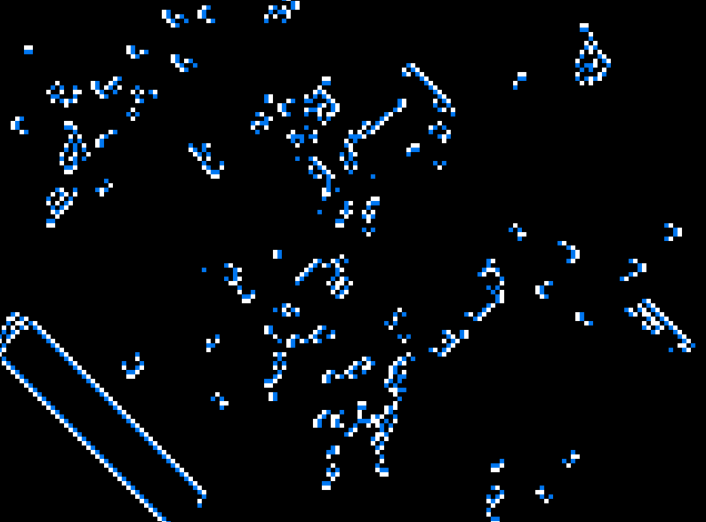

# Automata
A generic engine for running 2D cellular automata where the next generation of cells depends on the state of its neighbors.



## Supported Automata
- [Conway's Game of Life](https://en.wikipedia.org/wiki/Conway%27s_Game_of_Life)
- [Cyclic Automata](https://en.wikipedia.org/wiki/Cyclic_cellular_automaton)
- [Brian's Brain](https://en.wikipedia.org/wiki/Brian%27s_Brain)

## Usage
Run `automata --help` to see the full help text.

### General Options
- Screen size: `--fullscreen` or `--width <WIDTH>` and `--height <HEIGHT>` in pixels
- Cell size: `--cell-size <CELL_SIZE>` in pixels (default: 5)
- Number of threads: `--threads <THREADS>` (default: 4)
    - how many worker threads are used to compute the next generation
- Number of chunks: `--chunks <CHUNKS>` (default: 32)
    - how many chunks the grid is divided into before distributing to the worker threads
- Generations per second: `--gens-per-sec <GENS_PER_SEC>` (default: 10)
    - target for how many generations to compute every second
    - use the mouse scrollwheel in the application window to increase or decrease while running

### Conway's Game of Life (`life`)
- Birth and survival rule: `--rule <RULE>` (default: "B3S23")
    - see [Life-like cellular automaton](https://en.wikipedia.org/wiki/Life-like_cellular_automaton)
    - my personal favorite is "B3S134" which creates blobs of cells with cancer-like growth
- Percentage alive: `--percentage <PERCENTAGE>` (default: 50)

### Cyclic Automata (`cyclic`)
- Threshold: `--threshold <THRESHOLD>` (default: 1)
    - the number of neighbors that must match the next number in the cycle for a cell to change 
- Palette: `--palette <PALETTE>` (default: "grayscale")
    - the color palette to use for different values of the cycle
    - options: "grayscale" and "rainbow"

### Brian's Brain (`brain`)
- Percentage alive: `--percentage <PERCENTAGE>` (default: 50)
    - if alive, flips a coin to determine if the cell starts as "alive" or "dying"

## Build From Source
```sh
git clone https://github.com/aidantlynch00/automata.git
cd automata
cargo build --release

# Run the binary
./target/release/automata --help
```
